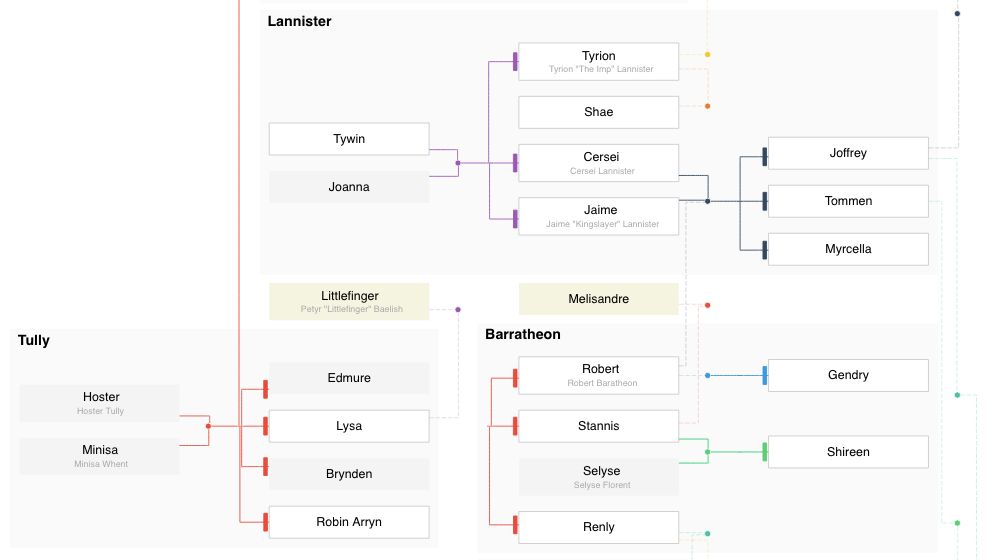

# family-tree

> Plots family trees using JavaScript and Graphviz

A family tree plotter with a very simple syntax. It probably doesn't cover everything you need, but covers 90% of it for the sake of simplicity.



Usage
-----

```
family-tree family.yml > family.svg
```

Getting started
---------------

A family tree is a [YAML](http://yaml.org/) file. Start with a `families` collection. Every family can have `parents` and `children`.

```diff
+families:
+  - parents: [Marge, Homer]
+    children: [Bart, Lisa, Maggie]
```

### Defining names

To define their full names, add a `people` collection. This is optional—people will still be in the family tree even if they don't have a `people` record.

```diff
 families:
   - parents: [Marge, Homer]
     children: [Bart, Lisa, Maggie]
+people:
+  Marge:
+    fullname: Marjorie Bouvier Simpson
```

### Second generations

To create second generations, you can simply add another record to `families`.

```diff
 families:
   - parents: [Marge, Homer]
     children: [Bart, Lisa, Maggie]
+  - parents: [Lisa, Milhouse]
+    children: [Zia]
```

### Houses

Turn a family into a house by adding a `house` name. They will show up grouped in a box.

```diff
families:
  - house: Stark
    parents: [Ned, Catelyn]
    children: [Arya, Rickon, Bran, Sansa, Rob]
  - house: Lannister
    parents: [Tywin, Joanna]
    children: [Cersei, Jaime, Tyrion]
```

To add families into a house, nest the families.

```diff
 families:
   - house: Simpson
     parents: [Marge, Homer]
     children: [Bart, Lisa, Maggie]
+    families:
+      - parents: [Lisa, Milhouse]
+        children: [Zia]
```

<details>
<summary>Why nest?<summary>

Families can be placed as sub-families of another families. This is more of a visual designation rather than a semantic one. If the parent family is a "house", then the sub-families will show up in the same house.

It also helps to untangle your YAML file.
</details>

More features
-------------

This is the part of the API that will help deal with bigger trees.

### Complex families

To express complex families, you can use `parents2` and `children2`. They will be drawn as dotted lines. Use this to express a different link, such as foster children or step parents.

```yml
families:
  - parents: [Ned, Catelyn]
    children: [Arya, Rickon, Bran, Sansa, Rob]
    children2: [Jon]
```

### Expressing relationships

All properties in a `Family` are optional (but you have to define at least one). You can use these to show other types of relationships.

```yml
families:
  # These guys are having an affair of sorts
  - parents2: [Loras, Renly]

  # No need to show their parents in the family tree,
  # but we want them to show up as siblings.
  - children: [Danaerys, Viserys, Rhaegar]
```

## Styling

Use `class` and `style` to style. Refer to Graphviz's [attributes documentation](http://graphviz.org/doc/info/attrs.html) for possible attributes.

```yml
people:
  James:
    fullname: James Potter
    class: [deceased]
styles:
  deceased:
    color: red
```

Further documentation
---------------------

For further reading:

- [Schema](docs/schema.md)

## Thanks

**family-tree** © 2016+, Rico Sta. Cruz. Released under the [MIT] License.<br>
Authored and maintained by Rico Sta. Cruz with help from contributors ([list][contributors]).

> [ricostacruz.com](http://ricostacruz.com) &nbsp;&middot;&nbsp;
> GitHub [@rstacruz](https://github.com/rstacruz) &nbsp;&middot;&nbsp;
> Twitter [@rstacruz](https://twitter.com/rstacruz)

[MIT]: http://mit-license.org/
[contributors]: http://github.com/rstacruz/family-tree/contributors
